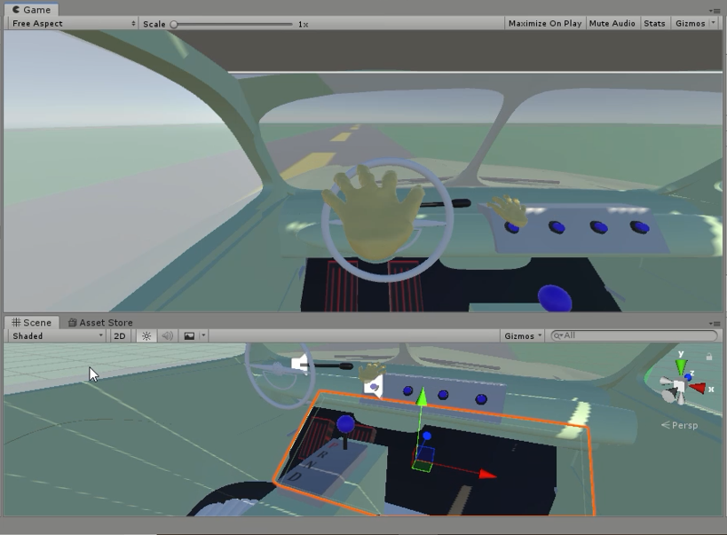
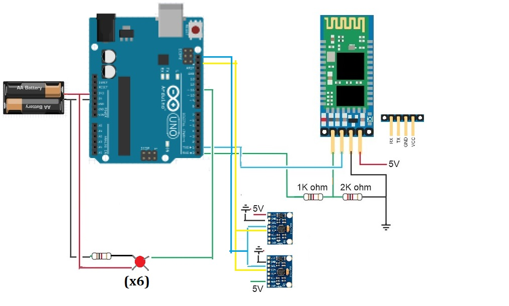

# Car VR

**What is it?** Car driving simulator using pseudo-VR controls. Manipulate objects with tilt controls and move your head to look around you. Car simulator includes gear shift, rolling windows, a radio, and windshield wipers. For a video demo, click [here](https://youtu.be/O3NI1iQK9uI)!

**How does it work?** To make the hands motion activated, I've created two controllers. Each contains a gyro/accelerometer and 3 buttons which are wired directly to an Arduino Uno. Additionally, an HC-06 Bluetooth controller is connected:

The bluetooth module relays all of the data from the gyroscope and buttons directly to the Unity app on the phone, so that it can respond appropriately. The user interface of the app is a Unity android app. This gives it access to the device's gyroscope, so no additional devices are needed to make the screen react to motion.

**Project Goals, Skills, and Tools** This project evolved as a combination of some ideas I wanted to try out. It began with an interest in learning Unity. I chose to make a car simulator because it would require me to play with how physics works in the program and I could extend the project for a long time if I enjoyed working on it. After learning that Unity can be run on mobile and being inspired by Google Cardboard, I decided to take a shot at making the controls more VR-esque.

Skills I developed/used:
* Restructuring code to be less repetitive. My initial programs had a lot of very similar code that needed to be slightly modified for a different situtation. For example, a lot of the actions for the hands is the same, but mirrored. After seeing this, I did a complete sweep of my code to eliminate as much redundancy as possible.
* Googling how to do everything. Obviously I use the internet a lot when programming any project, but as a newbie to Unity I was especially lost. I had to figure out how to add objects, change settings to make physics work, and learn syntax for C#.
* Persistence. This more than any project in recent memory has tested my ability to continue working on it. Everytime I fixed something in the code, some hardware would stop working. When I got another bit of functionality working, its domino effect would break the Unity physics engine.

New tools I learned:
* Unity. This was first project using it and other that messing around with it for a bit before starting, I jumped right in. 
* CAD. I've dabbled with tinkerCad before but I've never really used it in a project. Since the models I wanted for this were pretty easily availible or simple to make, it was a nice introduction to using 3D modelling in real applications.
* After much fiddling with wire, I decided I needed to use solder to keep the connections stable. Though this isn't my first time soldering, I'm far from experienced with it and this was a nice chance to practice.

**Reflection**
As I said, a lot of this project felt like moving one step forward, two steps back. However, I did make slow progress. Each time I got another feature working I felt a small part of the pride and accomplishment I get from working on these projects. That was enough to get me to push through and get it completely functional. Along the way I also got much more comfortable fixing hardware problems, soldering, and working in Unity. I'm extremely happy with how its turned out and I think it will be fun to keep the hardware setup for future projects.
